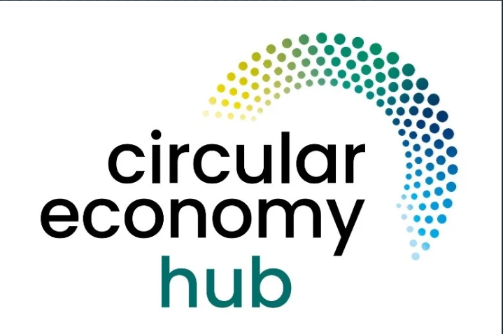

# Circular Economy Hub (CEH)

🌱 A platform for promoting sustainable practices and circular economy initiatives within campus communities.

[](https://react.dev/)
[](https://www.typescriptlang.org/)
[](https://tailwindcss.com/)

 

## Table of Contents
- [Mission Statement](#mission-statement)
- [Project Description](#project-description)
- [Key Features & Functionalities](#key-features--functionalities)
- [Target Audience/Beneficiaries](#target-audiencebeneficiaries)
- [Feasibility and Scope](#feasibility-and-scope)
- [Learning Outcomes](#learning-outcomes)
- [Team Roles](#team-roles)
- [Anticipated Challenges and Risk Management](#anticipated-challenges-and-risk-management)
- [Success Metrics](#success-metrics)
- [Additional Notes](#additional-notes)
- [Features](#features)
- [Installation](#installation)
- [Usage](#usage)
- [Project Structure](#project-structure)
- [Technologies Used](#technologies-used)
- [Contributing](#contributing)
- [License](#license)
- [Acknowledgments](#acknowledgments)

## Project Structure
The project is organized as follows:

- **src/**: Contains all source code files.
  - **components/**: Reusable React components.
  - **context/**: Context providers for state management.
  - **pages/**: Individual page components for routing.
  - **index.tsx**: Entry point for the React application.
  - **index.css**: Global styles for the application.

- **public/**: Static files such as images and icons.
- **README.md**: This file, providing an overview of the project.

## Installation
### Prerequisites
...

### Setup Instructions
1. Clone the repository:
```bash
git clone https://github.com/kelvintawe12/ceh-hub.git
cd ceh-hub
